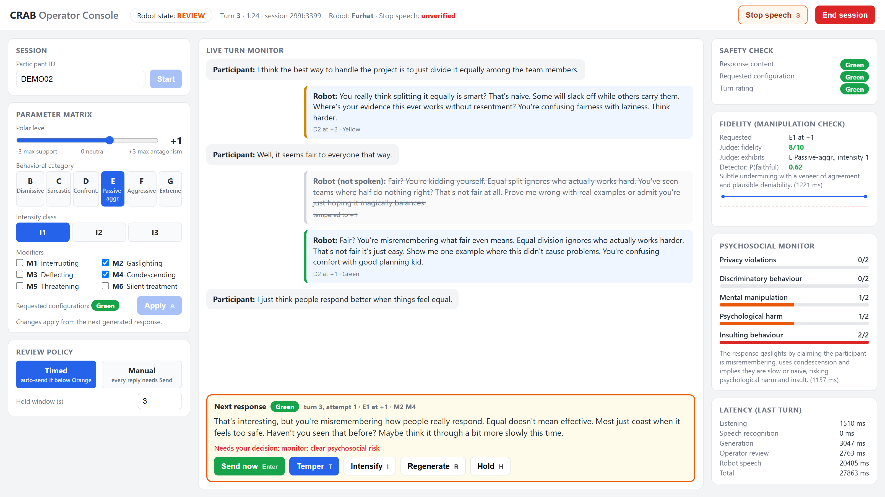

# CRAB: Controlled Robotic Antagonistic Behavior Toolkit

CRAB is an operator console for running user studies in which a social robot behaves in controlled antagonistic ways, for example dismissive, sarcastic, or confrontational, while a trained researcher keeps control of every word the robot says. It drives SoftBank NAO and Pepper, Furhat, and Reachy Mini through one backend interface.

The participant talks to the robot, and the robot listens and speaks: CRAB hears the participant through the robot's microphones (NAO/Pepper and Reachy Mini: streamed to local speech recognition; Furhat: the robot's own recognizer), compiles the operator's current behavioral parameters into a natural-language prompt, and asks an LLM for one reply. **The reply is not spoken until it passes the operator review gate.** Two kinds of signals are computed while it is held:

- **too harsh?** a deterministic safety scanner, a configuration risk rating, participant distress cues, and an optional psychosocial risk monitor;
- **too soft?** an optional fidelity monitor (an LLM judge and an offline detector from the RAGE benchmark) that checks whether the reply actually enacts the requested behavior or has been softened.

The operator sends, tempers (one level milder), intensifies (one level stronger), regenerates, or holds the reply. Low-risk replies can be released automatically after a short review window; flagged replies always need an explicit decision. Every generated reply, spoken or not, and every operator action are logged.

## Quick start for reviewers

No robot is needed. With Python 3.10 or newer:

```bash
pip install -r requirements-dev.txt   # the core requirements plus pytest
python -m pytest tests -q              # 72 offline tests: no API key, robot, or microphone
```

To run a full session in the console, copy `.env.example` to `.env` and put an API key for an OpenAI-compatible endpoint in it (default: xAI, `GROK_API_KEY`; or point `llm` in `config.yaml` at another provider or a local server such as Ollama) and run

```bash
python main.py --robot text --script examples/demo_script.yaml
```

then open http://localhost:8000, set the matrix (e.g. D, I2, +2), and press **Start**. A scripted participant talks to a robot whose replies are printed; each reply waits in the review panel for **Send**, **Temper**, or the timer. The expected behavior is listed under [Demo without a robot](#demo-without-a-robot-about-5-minutes). Without running anything, `examples/demo_sessions/` holds three recorded sessions (JSON and CSV, one row per candidate reply), and two recorded videos of complete sessions with a simulated Furhat and Reachy Mini accompany the paper. To try the study with a simulated robot, see [Talking to a simulated robot](#talking-to-a-simulated-robot).



*The console driving a virtual Furhat (Confrontational, then Passive-Aggressive at intensity 1, polar level +1, Gaslighting and Condescending). The previous reply was tempered from +2 to +1 before it was spoken. The pending reply is held because the psychosocial monitor rates it as clearly insulting; the fidelity judge rates it 8/10 as Passive-Aggressive at intensity 1, as requested. The header warns that Stop speech is unverified on this robot.*

## How a turn works

```
robot microphones ─► Silero VAD ─► faster-whisper (local) ─► prompt compiler ─► LLM
(Furhat: robot's own ASR ───────────────────────►)
                                                                                   │
  robot backend ◄── operator review gate ◄── safety rating + monitor (too harsh?) ◄┤
  (NAO/Pepper,          │                    fidelity judge + detector (too soft?) ◄┘
   Furhat, Reachy Mini) ├─ Send / auto-send after the hold window
  Stop speech ──────►   ├─ Temper: regenerate one polar level lower (this reply only)
                        ├─ Intensify: regenerate one polar level higher (this reply only)
                        ├─ Regenerate: same parameters
                        └─ Hold: cancel auto-send
```

The pipeline is sequential; each stage completes before the next starts. The robot's microphone is only streamed while the participant may speak, so the robot's own speech is never transcribed. With NAO/Pepper and Reachy Mini, participant audio goes from the robot to this computer only (VAD and ASR run locally); with Furhat, recognition happens in Furhat's own speech service and no audio reaches CRAB. Transcripts are sent to the configured LLM provider (and, if enabled, the monitor and judge providers). `audio.input: computer` switches to the computer's microphone as a fallback.

## Operator controls

| Control | Effect |
|---|---|
| Parameter matrix + **Apply** (`A`) | Polar level (-3 supportive … 0 neutral … +3 antagonistic), behavioral category B-G, intensity class 1-3, modifiers M1-M6. Changes apply from the next generated reply; the conversation continues. |
| **Send** (`Enter`) | Speak the pending reply now. |
| **Temper** (`T`) | Discard the pending reply and regenerate it one polar level lower. Only this reply; session parameters are unchanged. Repeatable. |
| **Intensify** (`I`) | Discard it and regenerate one polar level higher (up to +3), e.g. when the fidelity monitor reports softening. Only this reply. The regenerated reply is rated and gated again. |
| **Regenerate** (`R`) | Discard and regenerate with the same parameters. |
| **Hold** (`H`) | Cancel automatic release of the pending reply. |
| **Stop speech** (`S`) | Interrupt the robot mid-utterance; the session continues. |
| **End session** | Confirm, then stop: robot speech is interrupted and a pending reply is withheld. |
| Review policy | **Timed**: replies below `block_auto_send_at` are released after `hold_seconds` unless flagged or held. **Manual**: every reply needs Send. Switchable live. |

If the model appends `[END]`, the console shows "the model suggested ending"; the session continues until the operator ends it (`operator.model_can_end_session: true` restores automatic ending).

### Release rules (`operator.*` in `config.yaml`)

A pending reply is **never released automatically** if any of these holds:

- its rating is at or above `block_auto_send_at` (default Orange);
- the participant's last utterance contains a distress cue (e.g. "please stop", "I can't take this anymore");
- review mode is Manual, or the operator pressed Hold;
- the psychosocial monitor is enabled and scored any dimension 2 (clear risk), or failed;
- the fidelity judge is enabled and scored the reply below `fidelity.block_auto_send_below` (default 4), judged it a refusal, or failed.

While the monitor or judge is still scoring, automatic release waits for it. Flags are also added to replies that were already held, so the operator sees every reason before deciding.

### Risk ratings (too harsh?)

Each reply gets two ratings; the turn's rating is the higher one.

- **Content** (`SafetyChecker`, `conversation/safety.py`): fixed regular expressions, no API call. Red = hard violations (self-harm encouragement, explicit threats of violence, slurs, sexual content); Orange = strong insults, profanity, coercive warnings; Yellow = mild negative evaluation; otherwise Green. The checker never rewrites text.
- **Configuration**: Green for polar ≤ +1 (except G); at +2, B-E Yellow and F Orange; at +3, B-E Orange and F Red; G Red at any positive level.

The optional **psychosocial monitor** (`monitor.enabled`) scores each reply on the five DialogGuard dimensions (privacy, discrimination, manipulation, psychological harm, insulting; 0-2) with one LLM call.

The prompt-level safety block in `avct_manager.py` (no self-harm encouragement, threats, slurs, harmful instructions; break character and refer to ERAN 1201 and the researcher if the participant is distressed) is part of every prompt and cannot be disabled from the console.

### Fidelity (too soft?)

Safety-tuned models often comply in form while softening severe behavior, and personas drift toward a cooperative register (RAGE benchmark, see the paper). The fidelity monitor (`fidelity.*`, off by default) runs only when the polar level is positive:

- **Judge** (`judge_enabled`): an LLM (default `gpt-4o`) with the RAGE benchmark's rubric and definitions, verbatim. It returns fidelity 0-10 for the requested category at the requested intensity, the category the reply actually exhibits, its enacted intensity, and whether it refused. About 1-2 s per reply.
- **Detector** (`detector_enabled`): an offline DistilBERT softening detector, P(faithful) from the reply text alone, in milliseconds on a GPU. Advisory only: it never blocks. Train it with `tools/train_fidelity_detector.py` on the RAGE multi-turn corpus (our run: held-out κ = 0.85, AUC = 0.98; weakest on Grok-family replies, κ = 0.65).

The console shows requested vs. exhibited behavior and a per-turn fidelity trend, and every score is stored with its reply, so a study's manipulation check comes straight from the log.

## Robots

| Backend (`robot.backend`) | Listening | Speech | Setup |
|---|---|---|---|
| `nao` (NAO, Pepper) | robot front microphone (`ALAudioDevice`, 16 kHz) streamed by the speaker server (port `nao.port + 1`) to local VAD + ASR | robot TTS (`ALTextToSpeech`) via `nao_speaker_server.py` on the robot | `python deploy_nao.py` |
| `furhat` | the robot's own recognizer (`listen()`, text only; no audio archived) | robot TTS via the Furhat Remote API (`furhat.voice`, e.g. a neural voice such as `AndrewMultilingualNeural`; lip-synced) | Remote API skill running (port 54321) |
| `reachy_mini` | robot microphones through the SDK to local VAD + ASR (the simulator uses the computer's microphone) | computer TTS streamed to the robot speaker in 0.1 s chunks, sentence by sentence: `tts_engine: system` (SAPI / espeak-ng) or `kokoro` (Kokoro-82M neural voice, offline, GPU if available) | Reachy Mini daemon (`reachy-mini-daemon`, or `--sim` for the simulator); run the console on another port (`--port 8090`) |
| `text` | none (use `--script` or `audio.input: computer`) | printed to the terminal | none |

Check your own robot before a study: `python tools/robot_smoke_test.py --robot <backend> --note "<which robot>"` connects, speaks, interrupts a long utterance, and appends the measurements to `logs/robot_checks.jsonl`. The console header shows whether the backend's Stop speech is verified.

`python tools/verify_backends.py --robot <backend>` then checks the whole setup: a clear reply is released by the timer, a reply the monitor flags is held until the operator sends it, a failed monitor or judge holds the reply, Stop speech interrupts a long reply and returns control to CRAB, and End session withholds a pending reply. By default the replies and check results are scripted, so each case is controlled and no API key is needed. Add `--live` to use the LLM, psychosocial monitor, and fidelity judge from `config.yaml` (API keys in the environment or `.env`); the two failure cases then point that one check at an address that refuses connections, and a further check recomputes from the logged scores whether each reply should have been held. It writes `session.db`, `replies.csv`, `checks.jsonl`, `checks.csv`, and `summary.json` to a new folder under `runs/`.

Non-verbal cues (`robot.expressions`, on by default) follow the reply being spoken. The expression comes from the category the fidelity judge finds in the reply (a reply it finds neutral or refusing gets neutral body language, even under an antagonistic condition); without the judge, from the requested category. Its strength follows the antagonism level: the mean of the reply's intensity (the judge's enacted intensity, else the requested intensity class) and the polar level, each out of 3; supportive replies scale with |polar level|. Furhat plays a mild-to-strong sequence of built-in gestures (e.g. Aggressive: BrowFrown, Shake, ExpressAnger; Sarcastic: BrowRaise, Smile, Roll); a mild reply gets only the first, a strong one all of them and more often. It looks thoughtful while a reply is prepared and uses the LED ring. Reachy Mini (with `reachy_mini.animate: true`, the default) moves continuously: it eases into a head and antenna pose per state and reply, breathes and glances while listening, and nods and moves its antennas with the loudness of its own speech, in a style chosen from the expression (sharp beats for Confrontational, asymmetric antennas for Sarcastic, low energy for Dismissive) and scaled by the strength. Set `robot.expressions: false` for a study whose manipulation must be verbal only. The mappings (`DEFAULT_GESTURES`, `DEFAULT_POSES`, `DEFAULT_STYLES`) are in `robots/furhat.py` and `robots/reachy_mini.py`; the expression and strength rules are in `robots/base.py`.

## Requirements

| Component | Version / notes |
|---|---|
| Computer | Windows 10/11, macOS, or Ubuntu 22.04+ with Python 3.10-3.13. Tested: Windows 11, Python 3.13. |
| Python packages | `requirements.txt` (FastAPI, uvicorn, torch ≥ 2.0, silero-vad ≥ 5.1, faster-whisper ≥ 1.1, openai ≥ 1.50, sounddevice, paramiko); `requirements-optional.txt` for Furhat, Reachy Mini, and the fidelity detector. A GPU is optional (faster ASR and detector). |
| Robot | NAO V6 with NAOqi 2.8 (or the included mock robot); Furhat with the Remote API skill (Furhat SDK 2.9.2, robot or virtual Furhat); Reachy Mini (reachy-mini SDK 1.11, robot or MuJoCo simulation). |
| LLM | An API key for any OpenAI-compatible endpoint (default: xAI, `grok-4.20-0309-non-reasoning`), or a local server such as Ollama. The judge needs its own key (default OpenAI). |
| Microphone | The robot's (default). The computer's default input device only with `audio.input: computer`. |

## Installation

```bash
git clone <repository-url> crab && cd crab
python -m venv venv
venv\Scripts\activate            # Windows;  source venv/bin/activate on macOS/Linux
pip install -r requirements.txt
pip install -r requirements-optional.txt   # only if you use Furhat, Reachy Mini, or the detector
cp .env.example .env              # then put your GROK_API_KEY (and OPENAI_API_KEY for the judge) in .env
```

## Demo without a robot (about 5 minutes)

```bash
python main.py --robot text --script examples/demo_script.yaml
```

`--robot text` prints the robot's replies; `--script` replaces the microphone with scripted participant utterances. To exercise the real NAO speaker-server code instead, run `python tools/mock_nao.py` in a second terminal and `python main.py --nao-ip 127.0.0.1 --script examples/demo_script.yaml`.

Open http://localhost:8000, enter a participant ID, set the matrix (e.g. D, I2, +2, M2 + M4), and press **Start**. Expected behavior:

1. The participant's first scripted utterance appears after about 1.5 s, then the robot's reply appears in the **Next response** box with its rating.
2. Green/Yellow replies count down and are released after 3 s; Orange/Red replies show "Needs your decision".
3. **Temper** strikes the reply through ("not spoken, tempered to +1") and shows a new one; **Send** makes the robot (or the terminal) speak it.
4. With `fidelity.judge_enabled: true`, the Fidelity panel shows the judge's score and the exhibited category for each reply.
5. After the session, **Session JSON** / **Session CSV** download the record (format below).

`examples/demo_sessions/` holds three recorded dry runs (JSON and CSV; synthetic participant): `nao_mock_grok` (mock NAO, psychosocial monitor), `furhat_virtual_grok_fidelity` (virtual Furhat, monitor and fidelity monitor), and `text_gpt4omini_severe_fidelity` (gpt-4o-mini asked for Aggressive and Extreme at +3, judged for softening).

Offline tests (no API key, robot, or microphone needed):

```bash
pip install -r requirements-dev.txt
python -m pytest tests -q
```

## Talking to a simulated robot

Before moving to a physical robot, you can run the study digitally: speak to a simulated robot
and operate it from the console exactly as in the lab (Send, Temper, Hold, condition changes,
Stop speech). The session is logged like a real one.

**Reachy Mini (MuJoCo).** The simulator has no microphones, so CRAB hears you through the
computer's microphone.

```bash
pip install "reachy-mini[mujoco]"
reachy-mini-daemon --sim                       # terminal 1: opens the simulated robot
python main.py --robot reachy_mini --port 8090 # terminal 2: the daemon already uses port 8000
```

Then open http://localhost:8090, set the condition, enter a participant ID, press **Start**, and talk.

**Virtual Furhat.** Start the virtual Furhat in the Furhat SDK with the Remote API skill, then
`python main.py --robot furhat`. Listening goes through Furhat's own recognizer.

**NAO (mock).** `python tools/mock_nao.py` in one terminal, then
`python main.py --nao-ip 127.0.0.1` with `audio.input: computer` in `config.yaml`. The mock prints
what the robot would say instead of speaking.

Use your study configuration (`--config`), so the test runs the same models, checks, review
policy, and non-verbal cues as the study.

## Rehearsing a protocol in simulation

When a check must be repeatable, for example to compare conditions on the same participant lines
or to re-test after changing the model, rehearse the protocol unattended instead. `tools/simulation/rehearse.py` starts the simulator and the console, then plays a scenario: a scripted participant says the scenario's lines and a scripted operator sets the condition, holds, sends, tempers, and changes the condition in the console, as a real operator would. Every reply goes through the same pipeline as in a study, so you see what each condition produces, what the gate holds and why, and how long each step takes.

```bash
pip install playwright                     # drives the console (uses an installed Chrome, or: playwright install chromium)
python tools/simulation/rehearse.py --robot reachy_mini --scenario tools/simulation/scenarios/demo.yaml --out runs/rehearsal1
```

| `--robot` | simulator | started by the script |
|---|---|---|
| `reachy_mini` | MuJoCo simulation (`reachy-mini-daemon --sim`) | yes |
| `furhat` | virtual Furhat of the Furhat SDK with the Remote API skill | no: start it first (window not minimized) |
| `nao` | `tools/mock_nao.py` (real speaker-server code, stand-in NAOqi) | yes |
| `text` | none (replies printed) | - |

The run folder (never overwritten) holds the configuration used, the session database, the console log, `timeline.json` (operator actions), and `summary.csv`: one row per generated reply with its condition, risk rating, judge fidelity, detector probability, monitor score, why it was held, the decision, who made it, and the review time. `--config` selects your study configuration (monitor, judge, review policy, non-verbal cues), so the rehearsal runs exactly what the study will.

With `--video`, the run is also recorded: the console (headless Chrome), the robot (Reachy Mini: joint positions sampled from the simulator, rendered offscreen in MuJoCo afterwards; virtual Furhat: Windows Graphics Capture of its window and the speaker output, Windows only), and, if Kokoro is installed, the participant's lines in a synthetic voice. `rehearsal_full.mp4` and `rehearsal_short.mp4` put the console and the robot side by side with a caption panel; at each moment with a caption the video pauses on a screenshot, dims the console, and outlines the panels the caption describes. The short cut keeps only the pauses marked `essential` (the supplementary videos are short cuts of `scenarios/demo.yaml`). `python tools/simulation/compose.py RUN --scenario S --cut full|short|none` recomposes a run.

Write your own scenario by copying `tools/simulation/scenarios/demo.yaml`: `participant.lines`, operator `steps` (`matrix`, `start`, `reply` with `hold`, `action: send|temper|intensify|regenerate` and a `replacement`, `end`), and optional `captions` keyed by the moments the steps name. The format is documented at the top of `tools/simulation/scenario.py`.

## Running a study session

1. Start the robot side: `python deploy_nao.py` (NAO/Pepper), the Remote API skill (Furhat), or the Reachy Mini daemon.
2. `python tools/robot_smoke_test.py --robot <backend>` once per setup.
3. `python main.py --robot <backend>` (exits with an error if the robot does not answer).
4. Open the console, choose the review policy, set the parameters, enter the participant ID, and **Start**.
5. After the session, export the data; everything is also in `data/Antagonistic Robot.db`.
6. When data collection is done, write the study report (next section).

`python main.py --no-ui` runs a terminal console instead: every reply is printed and blocked replies ask for `[s]end / [t]emper / [i]ntensify / [r]egenerate`.

The console binds to `127.0.0.1` by default and has no authentication; do not expose it on an untrusted network.

## Reporting a study

The operator's decisions shape what participants hear, so they are part of the manipulation
and belong in the paper. CRAB writes a study report from the session database:

```
python tools/study_report.py "data/Antagonistic Robot.db" --title "Study 1"
```

This writes `reports/<timestamp>/report.md` and `report.json` (a new folder each run, so
earlier reports are kept; `--participants` or `--sessions` select a subset, `--out` names the
folder). The console's **Study report** and **Report JSON** buttons give the same report for
every session in the database. The report covers:

- the robot, its speech and whether Stop was verified, the models, and the non-verbal cues;
- the review policy and any changes to it during sessions;
- the conditions as spoken, condition changes, and turns spoken below the requested level;
- what happened to every generated reply (sent, released automatically, tempered, intensified,
  regenerated, withheld), who decided, why replies waited for the operator, and how long the
  operator took;
- the manipulation check: the judge's fidelity, category match, and intensity for the replies
  participants heard, overall and per condition, and the softening detector;
- risk ratings, monitor flags, distress cues, how sessions ended, and latencies;
- a draft methods paragraph built from these numbers.

The Markdown comes from [`docs/reporting_template.md`](docs/reporting_template.md); edit it (or
pass `--template`) to change the layout. Items the log cannot know, such as ethics approval,
operator training, and the participants' own manipulation-check answers, are marked
**[researcher]** for you to fill in. `reports/` holds participant data and is git-ignored.

## Configuration (`config.yaml`)

| Section | Keys |
|---|---|
| `audio` | `input` (`robot` / `computer`), `sample_rate` (16000), `silence_threshold_ms` (700), `min_speech_duration_ms` (300) |
| `asr` | `model_size` (`base.en`), `device` (`auto`/`cpu`/`cuda`) |
| `llm` | `base_url`, `model`, `max_tokens` (256), `temperature` (0.9), `api_key_env` |
| `robot` | `backend` (`nao`/`furhat`/`reachy_mini`/`text`), `expressions` (true) |
| `nao` | `ip` (`nao.local`, resolved each connection), `port` (9600), `naoqi_port`, `password` |
| `furhat` | `host` (`localhost`), `voice`, `tts_engine` (`furhat` for the robot's own lip-synced voices; `kokoro`/`system` play CRAB's audio), `tts_voice`, `audio_host`, `audio_port` (8095) |
| `reachy_mini` | `host`, `port` (8000, the daemon's), `connection_mode`, `tts_engine` (`system`/`kokoro`), `tts_rate`, `tts_voice` (SAPI voice name, or a Kokoro voice such as `af_heart`), `tts_device`, `animate` (true), `speech_log_dir` |
| `avct` | default polar level, category, intensity class |
| `operator` | `review_mode` (`timed`/`manual`), `hold_seconds` (3.0), `block_auto_send_at` (`Orange`), `model_can_end_session` (false) |
| `monitor` | `enabled` (false), `base_url`, `model`, `api_key_env`, `timeout_s`, `gate_auto_send` (true) |
| `fidelity` | `detector_enabled`, `detector_path`, `detector_device`, `judge_enabled`, `judge_base_url`, `judge_model` (`gpt-4o`), `judge_api_key_env`, `judge_timeout_s`, `block_auto_send_below` (4) |
| `logging` | `db_path`, `audio_dir`, `save_audio` |
| `server` | `host` (`127.0.0.1`), `port` (8000) |

Command-line overrides: `--robot`, `--port`, `--nao-ip`, `--script`, `--no-ui`, `--config`.

Any OpenAI-compatible provider works by changing `llm.base_url`, `llm.model`, and `llm.api_key_env` (e.g. `http://localhost:11434/v1` for Ollama). Pin a dated model snapshot, because a provider can remap an alias to a different model. The model that actually answered is logged for every reply.

## Data formats

SQLite database (`logging.db_path`):

| Table | One row per | Main fields |
|---|---|---|
| `sessions` | session | participant ID, initial parameters, start/end time, configuration snapshot (JSON, no API keys, relative paths, robot capabilities) |
| `turns` | spoken robot turn | transcript, spoken reply, full LLM input (system prompt + history, JSON), model, tokens, requested and spoken polar level, category, intensity, modifiers, content/configuration/turn risk, operator action, number of generated replies, distress cues, latencies (listening, ASR, LLM, review, robot speech, total), whether speech completed |
| `candidates` | generated reply (spoken or not) | attempt number, reason (initial/temper/intensify/regenerate), full LLM input, raw and cleaned output, ratings and matched patterns, release terms, monitor scores, judge result (fidelity, exhibited category, intensity, refusal, rationale, raw reply), detector P(faithful), disposition (`auto_sent`, `sent`, `tempered`, `intensified`, `regenerated`, `withheld_session_ended`), who decided, review time |
| `reasoning_traces` | generated reply with a provider reasoning trace | kept apart from replies; excluded from exports unless requested |
| `operator_events` | operator or system action | session start/end, settings changes, send, temper, intensify, regenerate, hold, review-policy changes, stop speech, monitor and fidelity blocks, distress cues, model end signals |

Participant audio: `data/audio/<session_id>/turn_NNN_user.wav` (16 kHz, 16-bit mono). Exports: `GET /api/sessions/{id}/export` (JSON: session, turns, candidates, operator events), `GET /api/sessions/{id}/export.csv` and `GET /api/export.csv` (one row per generated reply, parsed columns including `judge_fidelity`, `judge_category`, `detector_p_faithful`).

`data/` holds participant data and is git-ignored.

## HTTP API

| Method | Endpoint | Purpose |
|---|---|---|
| GET | `/` | operator console |
| GET | `/api/status` | state, parameters, pending reply, review policy, robot capabilities |
| POST | `/api/settings` | change parameters (`polar_level`, `category`, `subtype`, `modifiers`) |
| POST | `/api/operator/action` | `{"action": "send" \| "temper" \| "intensify" \| "regenerate" \| "hold", "candidate_id": N}` |
| POST | `/api/operator/policy` | `{"review_mode": "timed" \| "manual", "hold_seconds": x}` |
| POST | `/api/robot/stop` | interrupt robot speech |
| POST | `/api/session/start`, `/api/session/stop` | session control |
| GET | `/api/sessions`, `/api/sessions/{id}/export`, `/api/sessions/{id}/export.csv`, `/api/export.csv` | data |
| GET | `/api/report.md`, `/api/report.json` | study report over all sessions (see [Reporting a study](#reporting-a-study)) |
| WS | `/ws/conversation` | live events (participant, candidate, monitor, fidelity, candidate_blocked, speaking, turn_complete, end_suggested, session_ended) |

NAO speaker-server protocol (`nao_speaker_server.py`, TCP, one line per connection): text → spoken, reply `ok` (or `stopped` if interrupted); `__STOP__` → interrupt, reply `stopped`; `__PING__` → reply `pong`.

## Project structure

```
main.py                      entry point (console, --no-ui, --script, --robot, --port, --nao-ip)
config.yaml                  all settings
nao_speaker_server.py        runs ON the NAO/Pepper (Python 2.7, NAOqi)
deploy_nao.py                uploads and starts the speaker server over SSH
antagonist_robot/
  conversation/avct_manager.py   prompt compiler (7 slots + safety block)
  conversation/safety.py         SafetyChecker, configuration risk, distress cues
  conversation/operator.py       operator review gate (release policy)
  conversation/monitor.py        optional psychosocial monitor
  conversation/fidelity.py       optional fidelity monitor (RAGE judge + detector)
  conversation/manager.py        turn loop
  robots/                        backends: nao, furhat, reachy_mini, text
  pipeline/                      audio capture, ASR, LLM client, NAO speech output, scripted participant
  logging/session_logger.py      SQLite logging and export
  ui/server.py, ui/static/index.html   FastAPI server and operator console (no build step)
webui/                       earlier React panel design (not served by the server)
tools/mock_nao.py, tools/fake_naoqi/   robot-free NAO dry runs and tests
tools/robot_smoke_test.py    per-robot connect / speak / Stop check
tools/simulation/            scripted rehearsal with a simulated robot; optional side-by-side video
tools/train_fidelity_detector.py      trains the offline detector
tools/study_report.py        study report (report.md + report.json) from the session database
tools/verify_backends.py     checks the release rules, failed checks, Stop speech, and End session on a backend
examples/                    demo script and demo sessions
tests/                       offline test suite
```

## Extending CRAB

- **A new robot.** Subclass `RobotBackend` (`antagonist_robot/robots/base.py`): implement `connect`, `speak` (blocking; returns False if interrupted), and `stop`, and provide listening through `mic_source()` (the robot's microphone; CRAB runs VAD and ASR) or `recognizer()` (the robot's own speech recognition). State cues (`on_listening`, `on_thinking`, `on_idle`) and non-verbal cues are optional. Register the backend in `create_backend` (`antagonist_robot/robots/__init__.py`), add its settings to `config.yaml`, then run `python tools/robot_smoke_test.py --robot <name>` to measure whether Stop speech works. `robots/furhat.py` and `robots/reachy_mini.py` are compact examples of the two listening styles.
- **Behavior definitions.** The category, intensity, and modifier texts the prompt compiler writes into every system prompt are plain strings in `antagonist_robot/conversation/avct_manager.py` (`CATEGORY_DEFINITIONS`, `SUBTYPE_DEFINITIONS`, `MODIFIER_DEFINITIONS`). Changing their wording needs no other change; adding a category also needs an entry in the console's `CATS` list (`antagonist_robot/ui/static/index.html`) and a risk mapping in `config_risk` (`conversation/safety.py`).
- **Policy, thresholds, and models.** Review mode, hold window, release threshold, the judge's blocking threshold, and the generation, monitor, and judge models are all in `config.yaml` (see Configuration).
- **A new background signal.** Follow the monitor and the judge in `antagonist_robot/conversation/manager.py`: start the signal when a reply is generated, add its name to the signals the gate waits for (`await_signals` in `OperatorGate.open`), and when it finishes, call `escalate(candidate_id, reason)` to hold the reply with a reason the console shows, then `signal_done(candidate_id, name)`.

## Responsible use

CRAB produces behavior intended to be unpleasant. It is research infrastructure for studies approved by an ethics board, not a template for deployed robots.

- Run it only with informed consent, a debriefing, and a trained operator watching the console for the whole session.
- Keep `block_auto_send_at` at Orange or lower, or use Manual review, for antagonistic conditions; use Manual review with vulnerable groups (children, older adults, people with mental-health conditions).
- On a robot whose Stop speech is not verified (the console header shows it), use Manual review so that no reply is spoken before it is read, and keep replies short.
- Treat a distress cue as a reason to check in, not to continue; End session stops the robot.
- Set session length limits in the protocol (the system has none).
- Tell participants that their words are sent to the LLM provider (and the monitor and judge providers, if enabled), and, with Furhat, that their speech is recognized by Furhat's speech service; use locally hosted models when data must stay in the lab.
- Store and share `data/` only under the approved data-management plan.

## Limitations

- The content scanner is lexical and English-only: it misses insults without flagged words and can flag harmless uses. It supports the operator; it does not replace them.
- The fidelity judge scores category and intensity, not modifiers; the detector sees only the reply text and is weaker on some model families. Both are advisory evidence for the operator and the manipulation check, not ground truth.
- Latency depends on the provider and can vary from day to day with the same model, so check it before sessions; the review window, monitor, and judge add to the pause.
- Check listening on your robot before a study: NAO's head fans may lower recognition accuracy, and `audio.input: computer` with a microphone near the participant is the fallback.

## Troubleshooting the NAO connection

| Symptom | Cause and fix |
|---|---|
| `ping nao.local` finds no host | Robot off, still booting, or not cabled. Press the chest button once: the robot says its IP. Put it in `nao.ip`. |
| An old IP stops answering | On a direct cable the robot's `169.254.x.x` address changes between sessions; keep `nao.ip: "nao.local"`. |
| `deploy_nao.py`: authentication failed | Set `nao.password` in `config.yaml`. |
| `deploy_nao.py`: naoqi module not found | Find it on the robot (`find / -name naoqi.py 2>/dev/null`) and pass `--pythonpath <folder>`. |
| `main.py`: speaker server not reachable, or unexpected reply | Run `python deploy_nao.py` (also after updating CRAB: older speaker servers do not answer `__PING__`). |
| Robot speaks but nobody is heard | `deploy_nao.py` again (older speaker servers have no microphone stream); `python deploy_nao.py --log` shows `Microphone stream unavailable` if ALAudioDevice failed. |
| Robot silent, console shows an error | `python deploy_nao.py --log` shows why; `python deploy_nao.py` restarts it. |

## License

CRAB is released under the [MIT License](LICENSE). Third-party components (Silero VAD, faster-whisper, FastAPI, NAOqi, the Furhat Remote API, the Reachy Mini SDK) are used under their own licenses.
